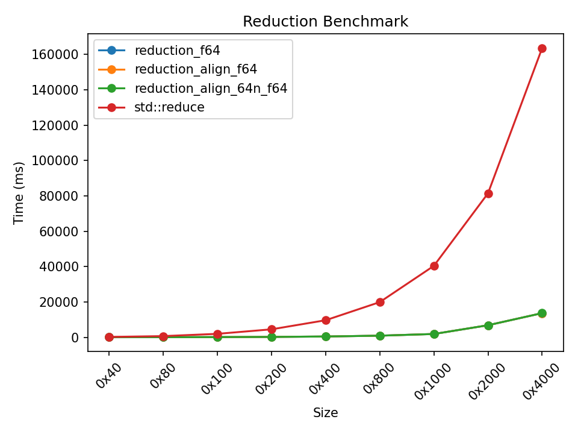

# reduction kernel

```
taskset -c 0 ./bench
i: 0x40
reduction_f64:  57791113 ns  (sum: 0X1.EA04801FCD99P+28)
reduction_align_f64:  57663513 ns  (sum: 0X1.EA04801FCD99P+28)
reduction_align_64n_f64:  57479820 ns  (sum: 0X1.EA04801FCD99P+28)
std::reduce:  234011813 ns  (sum: 0X1.EA04801FCD99P+28)

i: 0x80
reduction_f64:  85716465 ns  (sum: 0X1.F62D5D8FC20ECP+29)
reduction_align_f64:  84618932 ns  (sum: 0X1.F62D5D8FC20ECP+29)
reduction_align_64n_f64:  84377230 ns  (sum: 0X1.F62D5D8FC20ECP+29)
std::reduce:  699168637 ns  (sum: 0X1.F62D5D8FC20ECP+29)

i: 0x100
reduction_f64:  139962297 ns  (sum: 0X1.FAEA3F10C2E05P+30)
reduction_align_f64:  138862752 ns  (sum: 0X1.FAEA3F10C2E05P+30)
reduction_align_64n_f64:  137770680 ns  (sum: 0X1.FAEA3F10C2E05P+30)
std::reduce:  1986156022 ns  (sum: 0X1.FAEA3F10C2E05P+30)

i: 0x200
reduction_f64:  246841739 ns  (sum: 0X1.FEBEC690CD71EP+31)
reduction_align_f64:  246462790 ns  (sum: 0X1.FEBEC690CD71EP+31)
reduction_align_64n_f64:  245530487 ns  (sum: 0X1.FEBEC690CD71EP+31)
std::reduce:  4537107917 ns  (sum: 0X1.FEBEC690CD71EP+31)

i: 0x400
reduction_f64:  474924879 ns  (sum: 0X1.FC007A003D6ADP+32)
reduction_align_f64:  476281985 ns  (sum: 0X1.FC007A003D6ADP+32)
reduction_align_64n_f64:  477221071 ns  (sum: 0X1.FC007A003D6ADP+32)
std::reduce:  9677014767 ns  (sum: 0X1.FC007A003D6ADP+32)

i: 0x800
reduction_f64:  950022925 ns  (sum: 0X1.FEC387400333P+33)
reduction_align_f64:  938571161 ns  (sum: 0X1.FEC387400333P+33)
reduction_align_64n_f64:  937208031 ns  (sum: 0X1.FEC387400333P+33)
std::reduce:  19921362104 ns  (sum: 0X1.FEC387400333P+33)

i: 0x1000
reduction_f64:  1897570456 ns  (sum: 0X1.FED0AB2305999P+34)
reduction_align_f64:  1896797813 ns  (sum: 0X1.FED0AB2305999P+34)
reduction_align_64n_f64:  1890919215 ns  (sum: 0X1.FED0AB2305999P+34)
std::reduce:  40428319639 ns  (sum: 0X1.FED0AB2305999P+34)

i: 0x2000
reduction_f64:  6841253869 ns  (sum: 0X1.FC449E2BF8B87P+35)
reduction_align_f64:  6841644461 ns  (sum: 0X1.FC449E2BF8B87P+35)
reduction_align_64n_f64:  6842307354 ns  (sum: 0X1.FC449E2BF8B87P+35)
std::reduce:  81427848498 ns  (sum: 0X1.FC449E2BF8B87P+35)

i: 0x4000
reduction_f64:  13680369078 ns  (sum: 0X1.FCFFAFE31197BP+36)
reduction_align_f64:  13680048522 ns  (sum: 0X1.FCFFAFE31197BP+36)
reduction_align_64n_f64:  13681426239 ns  (sum: 0X1.FCFFAFE31197BP+36)
std::reduce:  163484196139 ns  (sum: 0X1.FCFFAFE31197BP+36)
```


